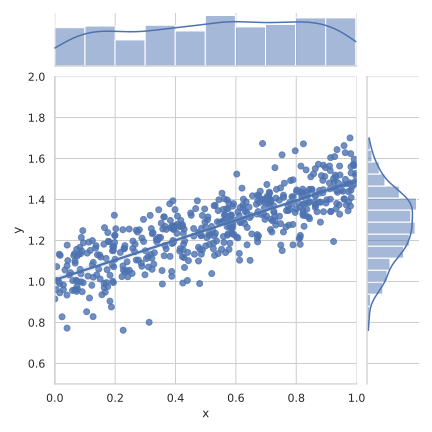

Pioupiou
================================================================================

 

Pioupiou is a nano probabilistic programming language, embedded into Python.

Use it to define probabilistic models :

    >>> import pioupiou as pp
    >>> a, b = 0.5, 1.0
    >>> X = pp.Uniform(0.0, 1.0)
    >>> E = pp.Normal(0.0, 0.1)
    >>> Y = a * X + b + E

and to simulate them :

    >>> omega = pp.Omega(1000) 
    >>> x, y = X(omega), Y(omega)
    >>> x # doctest: +ELLIPSIS
    array([6.36961687e-01, 2.69786714e-01, 4.09735239e-02, 1.65276355e-02,
           8.13270239e-01, 9.12755577e-01, 6.06635776e-01, 7.29496561e-01,
    ...
           7.80532350e-02, 3.83319397e-01, 1.64863718e-01, 3.80007897e-01])
    >>> y # doctest: +ELLIPSIS
    array([1.09588258, 1.22942954, 1.01954509, 0.99213115, 1.43243465,
           1.56003322, 1.24834735, 1.30271428, 1.10683473, 1.40516219,
    ...
           1.24528438, 1.22577905, 1.20728815, 0.9429806 , 1.14366864])

That's about it! Use this data as you see fit.

Getting started
--------------------------------------------------------------------------------

Install the latest version of pioupiou with:

    $ pip install --upgrade git+https://github.com/boisgera/pioupiou.git

Misc API Tests 
================================================================================

**Warning:** the interface is unstable

    >>> from pioupiou import *

Random Variables
--------------------------------------------------------------------------------

The universe
--------------------------------------------------------------------------------

A random variable 

    >>> restart()
    >>> U = Uniform(0.0, 1.0)
    >>> omega = Omega()
    >>> u = U(omega)
    >>> u
    0.6369616873214543

    >>> omega = Omega()
    >>> u = U(omega)
    >>> u
    0.2697867137638703

The universe is literally the source of the randomness of every variable :
sample `Universe` to get an `omega` and use it as an argument of a random
variable.
Once you have create a random variable, you can sample the universe
to get an `omega` 

    >>> restart()
    >>> U = Uniform(0.0, 1.0)
    >>> omega = Omega()
    >>> u = U(omega)
    >>> u
    0.6369616873214543

--------------------------------------------------------------------------------

    >>> restore()
    >>> U1 = Uniform(0.0, 1.0)
    >>> omega = Omega(10)
    >>> for u1 in U1(omega):
    ...     print(u1)
    0.6369616873214543
    0.2697867137638703
    0.04097352393619469
    0.016527635528529094
    0.8132702392002724
    0.9127555772777217
    0.6066357757671799
    0.7294965609839984
    0.5436249914654229
    0.9350724237877682

    >>> restore()
    >>> U2 = Uniform(0.0, U1)
    >>> omega = Omega(10)
    >>> for u2 in U2(omega):
    ...     print(u2)
    0.40572019111539415
    0.0727848709235085
    0.0016788296637499191
    0.0002731627361638972
    0.6614084819688684
    0.833122743851587
    0.3680069644406481
    0.5321652324874805
    0.2955281313457811
    0.8743604377283316

    >>> restore()
    >>> N = Normal(1.5, 2.7)
    >>> ns = N(Omega(10000))
    >>> print("mean:", np.mean(ns))  
    mean: 1.4950310577047152
    >>> print("std dev:", np.std(ns))
    std dev: 2.705182786283677

    >>> restore()
    >>> X, Y, Z = Uniform(), Uniform(1.0, 2.0), Normal()
    >>> print("dimension of the universe:", Omega.n)
    dimension of the universe: 3

    >>> restore()
    >>> U1 = Uniform()
    >>> U2 = Uniform(1.0, 2.0)
    >>> @function
    ... def add(x, y):
    ...     return x + y
    >>> X = add(U1, U2)
    >>> omega = Omega(10)
    >>> X(omega)
    array([2.45281524, 1.27252521, 1.8983778 , 1.05011321, 2.54292569,
           2.0884112 , 2.4698147 , 2.27095778, 1.84333688, 2.35775964])
    
    >>> @function
    ... def substract(x, y):
    ...     return x - y
    >>> Z = substract(X, X)
    >>> omega = Omega(10)
    >>> Z(omega)
    array([0., 0., 0., 0., 0., 0., 0., 0., 0., 0.])

    >>> restore()
    >>> print(exp(1.0))
    2.718281828459045
    >>> N1 = Normal(1.0, 0.001)
    >>> X = exp(N1)
    >>> omega = Omega(10)
    >>> X(omega)
    array([2.71923434, 2.71661479, 2.71355749, 2.71249422, 2.72070221,
           2.72197555, 2.71901739, 2.719944  , 2.71857969, 2.72240226])

    >>> restore()
    >>> N1 = Normal(1.0, 0.01)
    >>> N2 = Normal(2.0, 0.02)
    >>> X = N1 + N2
    >>> omega = Omega(10)
    >>> X(omega)
    array([3.02149701, 2.93831437, 3.00397961, 2.94207534, 3.02113554,
           2.99493823, 3.02459988, 3.00819522, 2.99059112, 3.01124626])

    >>> restore()
    >>> U1 = Uniform()
    >>> X = U1 + 1.0
    >>> Y = 1.0 + U1
    >>> Z = X * Y
    >>> omega = Omega(10)
    >>> X(omega)
    array([1.63696169, 1.26978671, 1.04097352, 1.01652764, 1.81327024,
           1.91275558, 1.60663578, 1.72949656, 1.54362499, 1.93507242])
    >>> Y(omega)
    array([1.63696169, 1.26978671, 1.04097352, 1.01652764, 1.81327024,
           1.91275558, 1.60663578, 1.72949656, 1.54362499, 1.93507242])
    >>> Z(omega)
    array([2.67964357, 1.6123583 , 1.08362588, 1.03332843, 3.28794896,
           3.6586339 , 2.58127852, 2.99115835, 2.38277811, 3.74450529])

    >>> restore()
    >>> U1 = Uniform()
    >>> B = (U1 >= 1/3)
    >>> omega = Omega(10)
    >>> B(omega) # doctest: +NORMALIZE_WHITESPACE
    array([ True, False, False, False, True, True, True, True, True, True])

Misc. TODO, notes
--------------------------------------------------------------------------------

**TODO.** Start with the random variables, talk about the universe later.
**Update.** Nope ; the new explicit parametrization of RV that enables
array support *requires* an explicit universe.